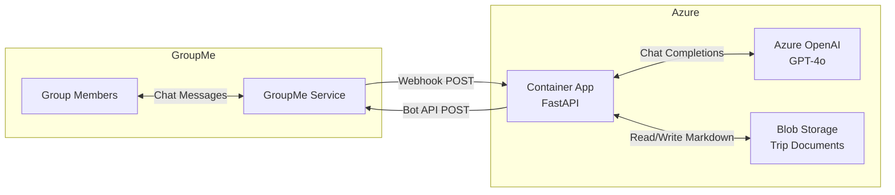
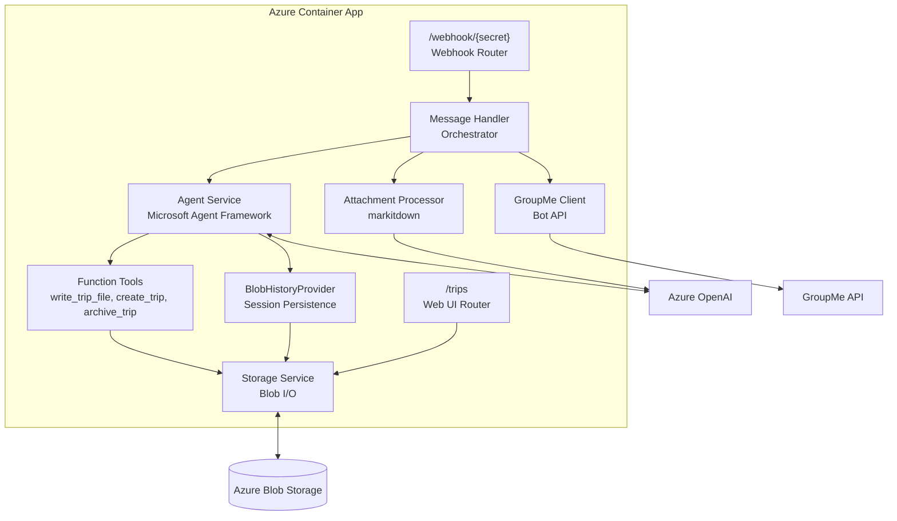
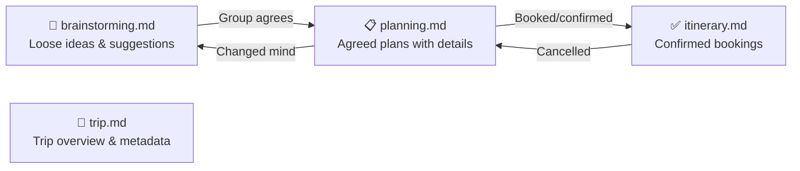
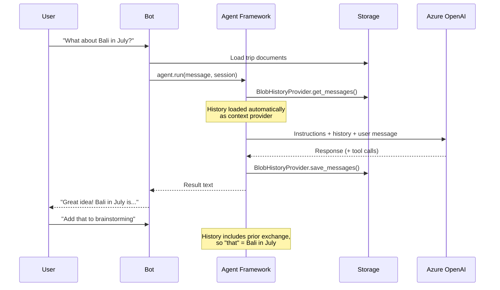
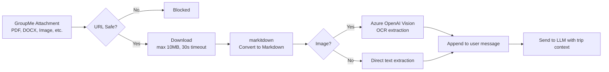
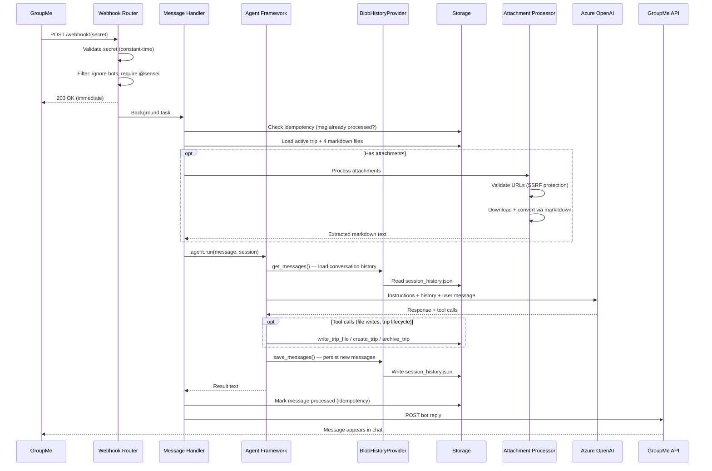

# Architecture Overview — Sensei Travel Bot

## System Context

Sensei is a GroupMe chatbot that helps groups collaboratively plan vacations. It participates in natural conversation, captures ideas, organizes plans, and produces a polished itinerary — all through a single GroupMe group chat.



## Core Design Principles

| Principle | Implementation |
|---|---|
| **LLM-first architecture** | The LLM reads all trip documents as context and returns both a chat reply and full file replacements — no traditional CRUD layer |
| **Markdown as storage** | All trip data is stored as markdown files in Blob Storage, not in a database. This makes documents human-readable, easy to render, and trivially versioned |
| **Serverless & cost-minimal** | Container Apps scales to zero, OpenAI is pay-per-token, Blob Storage is pennies/GB — zero cost at rest |
| **Managed identity everywhere** | No connection strings or API keys in code — all Azure service auth via user-assigned managed identity |

## Component Architecture



### Component Responsibilities

| Component | File | Role |
|---|---|---|
| **Webhook Router** | `routers/webhook.py` | Receives GroupMe webhooks, validates secret, filters messages, dispatches to background processing |
| **Web UI Router** | `routers/web.py` | Serves trip documents as a tabbed HTML page with shared-key authentication |
| **Message Handler** | `services/message_handler.py` | Thin orchestrator: loads trip context → processes attachments → routes to agent (or legacy) → sends reply |
| **Agent Service** | `services/agent.py` | Microsoft Agent Framework integration: creates agent with tools, middleware, context providers, and session |
| **Function Tools** | `services/tools.py` | `@tool`-decorated functions: `write_trip_file`, `create_trip`, `archive_trip` — invoked by the agent as side effects |
| **History Provider** | `services/history_provider.py` | `BlobHistoryProvider` extending framework's `HistoryProvider` — automatic conversation persistence via context provider pattern |
| **LLM Service (legacy)** | `services/llm.py` | Legacy path: builds system prompt, calls Azure OpenAI directly, parses structured JSON response. Used when `use_agent_framework=False` |
| **Attachment Processor** | `services/attachment_processor.py` | Downloads GroupMe file/image attachments, converts to markdown via markitdown (with OCR) — preprocessing step before agent |
| **Storage Service** | `services/storage.py` | All Blob Storage I/O: trip lifecycle, document read/write, idempotency |
| **GroupMe Client** | `services/groupme.py` | Posts bot replies via GroupMe API, handles message splitting (1000-char limit) |

## Data Architecture

### Blob Storage Layout

```
trips/
├── {group_id}/
│   ├── active_trip.json              ← Trip pointer: {"trip_id": "...", "trip_name": "..."}
│   ├── session_history.json          ← Agent Framework conversation history (last 40 messages)
│   ├── chat_history.json             ← Legacy conversation context (last 20 messages)
│   ├── {trip_id}/
│   │   ├── trip.md                   ← Destination, dates, participants, budget
│   │   ├── brainstorming.md          ← Ideas, wish-list items, suggestions
│   │   ├── planning.md              ← Agreed plans with research (not yet booked)
│   │   └── itinerary.md             ← Confirmed bookings with dates, times, confirmation #s
│   └── archived/
│       └── {old_trip_id}/            ← Archived trips (pointer deleted, files remain)
│           ├── trip.md
│           ├── brainstorming.md
│           ├── planning.md
│           └── itinerary.md
└── processed/
    └── {group_id}/
        └── msg-{message_id}          ← Idempotency markers (auto-deleted after 1 day)
```

### Four-Document Model

The LLM manages four markdown files that represent the trip planning lifecycle:



| Document | Stage | Content Style |
|---|---|---|
| **trip.md** | Always | Trip name, destination, dates, participants, budget, high-level notes |
| **brainstorming.md** | Ideas | Unstructured — any travel idea, wish-list item, or suggestion |
| **planning.md** | Agreed | Structured by category (🏨 Lodging, ✈️ Transport, 🎯 Activities, etc.) with researched details |
| **itinerary.md** | Confirmed | Organized by day/date with times, addresses, confirmation numbers, booking links |

### Agent Interaction Model

The bot uses the **Microsoft Agent Framework** for orchestration. The agent receives trip documents as instructions and uses function tools for side effects:

**Agent tools:**
| Tool | Purpose |
|---|---|
| `write_trip_file(filename, content)` | Write complete updated content to one of the 4 trip files |
| `create_trip(name)` | Create a new trip with initialized empty documents |
| `archive_trip()` | Archive the current trip |
| Web search | Live travel research via grounded web search |

The agent's chat reply is the bot's response. File writes happen as tool call side effects during the agent run — no JSON parsing or response contract needed.

**Legacy path** (when `use_agent_framework=False`): Uses a structured JSON response contract where the LLM returns `{message, file_updates}` and the message handler writes files.

## Conversation History

The bot maintains conversation continuity via the Microsoft Agent Framework's `HistoryProvider` pattern. A custom `BlobHistoryProvider` persists the last 40 messages per group in `session_history.json`. The framework automatically loads history before each run and saves new messages after — no manual read/write in the message handler.



**Legacy path** (when `use_agent_framework=False`): Falls back to manual `chat_history.json` read/write with the last 20 messages.

## Attachment Processing

Users can share files and images in GroupMe. The bot downloads them, extracts text via [markitdown](https://github.com/microsoft/markitdown), and passes the content to the LLM.



**Supported formats**: PDF, DOCX, PPTX, XLSX, JPEG, PNG  
**OCR**: Screenshots and photos are processed via GPT-4o vision  
**Safety**: HTTPS only, GroupMe domain allowlist, private IP blocking, 1MB output cap

## Request Lifecycle

Complete flow for a webhook message (agent framework path):


