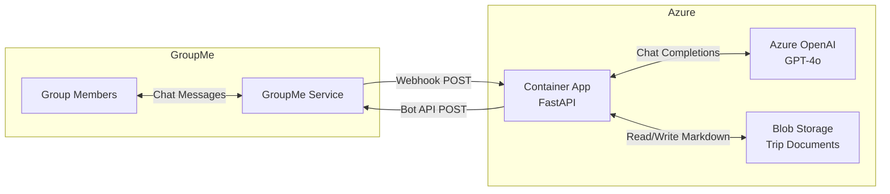
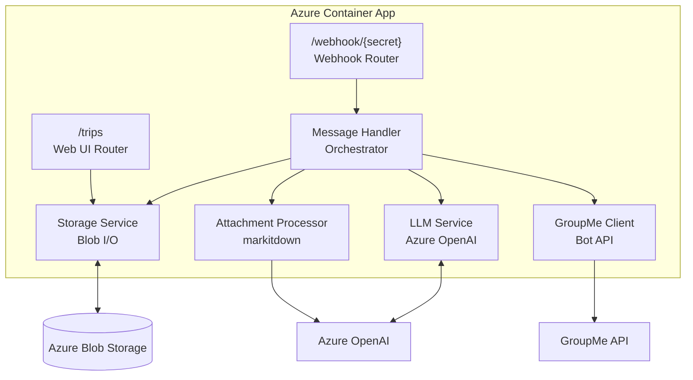
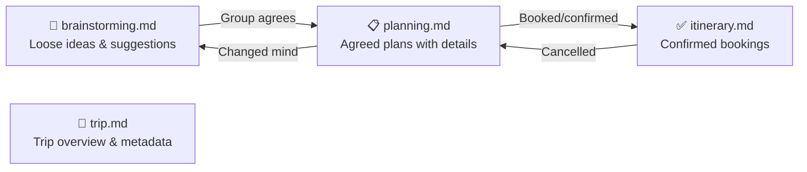
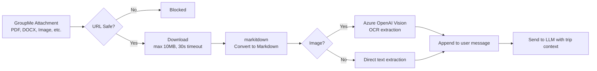
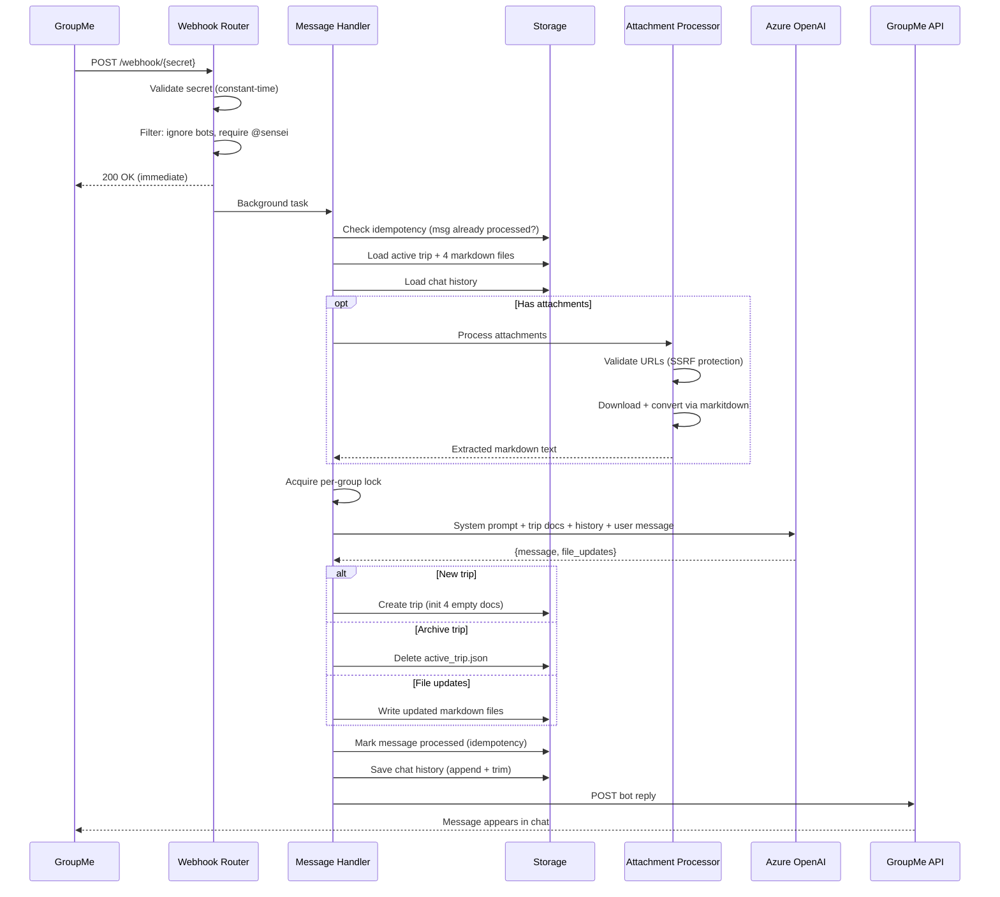

# Architecture Overview — Sensei Travel Bot

## System Context

Sensei is a GroupMe chatbot that helps groups collaboratively plan vacations. It participates in natural conversation, captures ideas, organizes plans, and produces a polished itinerary — all through a single GroupMe group chat.



## Core Design Principles

| Principle | Implementation |
|---|---|
| **LLM-first architecture** | The LLM reads all trip documents as context and returns both a chat reply and full file replacements — no traditional CRUD layer |
| **Markdown as storage** | All trip data is stored as markdown files in Blob Storage, not in a database. This makes documents human-readable, easy to render, and trivially versioned |
| **Serverless & cost-minimal** | Container Apps scales to zero, OpenAI is pay-per-token, Blob Storage is pennies/GB — zero cost at rest |
| **Managed identity everywhere** | No connection strings or API keys in code — all Azure service auth via user-assigned managed identity |

## Component Architecture



### Component Responsibilities

| Component | File | Role |
|---|---|---|
| **Webhook Router** | `routers/webhook.py` | Receives GroupMe webhooks, validates secret, filters messages, dispatches to background processing |
| **Web UI Router** | `routers/web.py` | Serves trip documents as a tabbed HTML page with shared-key authentication |
| **Message Handler** | `services/message_handler.py` | Thin orchestrator: loads trip context → processes attachments → calls LLM → writes results → sends reply |
| **LLM Service** | `services/llm.py` | Builds system prompt with trip documents, calls Azure OpenAI, parses structured JSON response |
| **Attachment Processor** | `services/attachment_processor.py` | Downloads GroupMe file/image attachments, converts to markdown via markitdown (with OCR) |
| **Storage Service** | `services/storage.py` | All Blob Storage I/O: trip lifecycle, document read/write, idempotency, chat history |
| **GroupMe Client** | `services/groupme.py` | Posts bot replies via GroupMe API, handles message splitting (1000-char limit) |

## Data Architecture

### Blob Storage Layout

```
trips/
├── {group_id}/
│   ├── active_trip.json              ← Trip pointer: {"trip_id": "...", "trip_name": "..."}
│   ├── chat_history.json             ← Rolling conversation context (last 20 messages)
│   ├── {trip_id}/
│   │   ├── trip.md                   ← Destination, dates, participants, budget
│   │   ├── brainstorming.md          ← Ideas, wish-list items, suggestions
│   │   ├── planning.md              ← Agreed plans with research (not yet booked)
│   │   └── itinerary.md             ← Confirmed bookings with dates, times, confirmation #s
│   └── archived/
│       └── {old_trip_id}/            ← Archived trips (pointer deleted, files remain)
│           ├── trip.md
│           ├── brainstorming.md
│           ├── planning.md
│           └── itinerary.md
└── processed/
    └── {group_id}/
        └── msg-{message_id}          ← Idempotency markers (auto-deleted after 1 day)
```

### Four-Document Model

The LLM manages four markdown files that represent the trip planning lifecycle:



| Document | Stage | Content Style |
|---|---|---|
| **trip.md** | Always | Trip name, destination, dates, participants, budget, high-level notes |
| **brainstorming.md** | Ideas | Unstructured — any travel idea, wish-list item, or suggestion |
| **planning.md** | Agreed | Structured by category (🏨 Lodging, ✈️ Transport, 🎯 Activities, etc.) with researched details |
| **itinerary.md** | Confirmed | Organized by day/date with times, addresses, confirmation numbers, booking links |

### LLM Response Contract

Every LLM response is a JSON object:

```json
{
  "message": "Conversational reply for the group chat",
  "file_updates": {
    "trip.md": null,
    "brainstorming.md": "# Full updated content...",
    "planning.md": null,
    "itinerary.md": null
  }
}
```

- `message` — Always present; the bot's chat reply
- `file_updates` — `null` means no change; non-null is a **full file replacement** (the LLM always returns complete documents, not diffs)
- `new_trip` — Special: triggers trip creation
- `archive_trip` — Special: archives the current trip

## Conversation History

The bot maintains a rolling window of the last 20 messages (10 exchanges) per group, stored in `chat_history.json`. This gives the LLM context for follow-up questions like "Yes, add that to the itinerary" without repeating what "that" is.

```mermaid
sequenceDiagram
    participant User
    participant Bot
    participant Storage
    participant LLM

    User->>Bot: "What about Bali in July?"
    Bot->>Storage: Load chat history
    Bot->>Storage: Load trip documents
    Bot->>LLM: [system prompt + trip docs] + [history] + [user message]
    LLM-->>Bot: {message, file_updates}
    Bot->>Storage: Save updated docs
    Bot->>Storage: Append user+assistant to history
    Bot-->>User: "Great idea! Bali in July is..."
    User->>Bot: "Add that to brainstorming"
    Note over Bot: History includes prior exchange,<br/>so "that" = Bali in July
```



## Attachment Processing

Users can share files and images in GroupMe. The bot downloads them, extracts text via [markitdown](https://github.com/microsoft/markitdown), and passes the content to the LLM.



**Supported formats**: PDF, DOCX, PPTX, XLSX, JPEG, PNG  
**OCR**: Screenshots and photos are processed via GPT-4o vision  
**Safety**: HTTPS only, GroupMe domain allowlist, private IP blocking, 1MB output cap

## Request Lifecycle

Complete flow for a webhook message:


