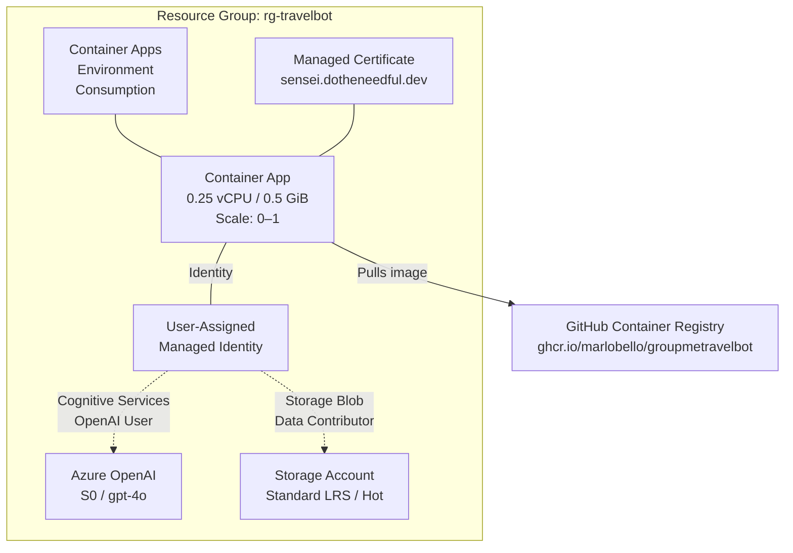
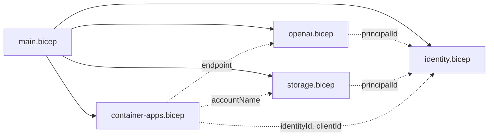
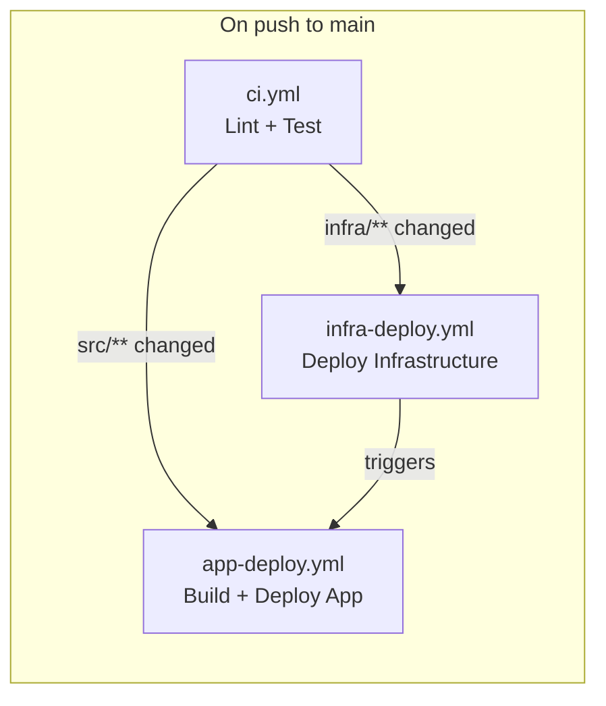

# Infrastructure — Sensei Travel Bot

## Azure Resources

All infrastructure is provisioned via Bicep templates. No manual resource creation.



### Resource Summary

| Resource | Type | SKU/Tier | Purpose |
|---|---|---|---|
| Managed Identity | `Microsoft.ManagedIdentity/userAssignedIdentities` | — | Authentication to all Azure services |
| Azure OpenAI | `Microsoft.CognitiveServices/accounts` | S0 | Chat completions (GPT-4o) and vision OCR |
| Storage Account | `Microsoft.Storage/storageAccounts` | Standard_LRS, Hot | Trip documents, chat history, idempotency markers |
| Container Apps Environment | `Microsoft.App/managedEnvironments` | Consumption | Serverless hosting environment |
| Container App | `Microsoft.App/containerApps` | 0.25 CPU, 0.5 GiB | FastAPI application |
| Managed Certificate | `Microsoft.App/managedEnvironments/managedCertificates` | — | TLS for custom domain |

## Bicep Structure

```
infra/
├── main.bicep                 # Orchestrator — wires all modules together
├── main.bicepparam            # Parameter values
└── modules/
    ├── identity.bicep         # User-assigned managed identity
    ├── openai.bicep           # Azure OpenAI account + GPT-4o deployment + RBAC
    ├── storage.bicep          # Storage account + blob container + lifecycle policy + RBAC
    └── container-apps.bicep   # Environment + app + secrets + custom domain + certificate
```

### Module Dependency Graph



### Parameters

| Parameter | Type | Description |
|---|---|---|
| `location` | string | Azure region (defaults to resource group location) |
| `environmentName` | string | Naming prefix for all resources |
| `groupmeBotId` | secureString | GroupMe bot ID for posting messages |
| `webhookSecret` | secureString | Secret path segment for webhook URL |
| `webAccessKey` | secureString | Shared key for web UI authentication |
| `containerImage` | string | GHCR image reference (tag or SHA) |
| `customDomainName` | string | Optional custom domain (e.g., sensei.dotheneedful.dev) |
| `managedCertificateName` | string | Optional managed certificate name |

## Key Infrastructure Decisions

### Storage: Blob Storage over Cosmos DB

The original design called for Cosmos DB, but Blob Storage was chosen instead:

| Factor | Cosmos DB | Blob Storage (chosen) |
|---|---|---|
| Cost at rest | ~$0 serverless, but RU charges per read/write | ~$0.02/GB/month, negligible for small text files |
| Data model fit | Overkill for 4 markdown files per trip | Perfect — files are the native abstraction |
| Complexity | SDK, partition keys, query language | Simple read/write by path |
| Versioning | Manual | Built-in blob versioning |
| Web rendering | Requires serialization/deserialization | Markdown files served directly |
| Recovery | Point-in-time restore ($) | Soft delete + versioning (free) |

### Container Apps: Consumption Plan

- **Scale 0–1**: Single instance is sufficient; scales to zero when idle for zero cost
- **No always-on**: Cold start (~5-10s) is acceptable for a chat bot
- **0.25 vCPU / 0.5 GiB**: Minimal resources — the app is I/O bound (waiting on OpenAI)

### Managed Identity: No Secrets in Code

All Azure service authentication uses a single user-assigned managed identity with two RBAC roles:
- `Cognitive Services OpenAI User` → Azure OpenAI (chat completions)
- `Storage Blob Data Contributor` → Blob Storage (read/write trip documents)

The only secrets stored in Container Apps config are external service credentials:
- `groupme-bot-id` — GroupMe bot token
- `webhook-secret` — Webhook URL path secret
- `web-access-key` — Web UI shared access key

## Blob Storage Configuration

| Setting | Value | Reason |
|---|---|---|
| Replication | Standard_LRS | Cost minimal; single-region is fine for non-critical data |
| Access tier | Hot | Frequent reads during active planning |
| Minimum TLS | 1.2 | Security baseline |
| HTTPS only | Enabled | No unencrypted access |
| Public access | Disabled | All access via managed identity |
| Blob versioning | Enabled | Automatic version history for trip docs |
| Soft delete | 7 days | Recover accidentally overwritten/deleted files |
| Lifecycle policy | Delete `processed/*` after 1 day | Auto-cleanup idempotency markers |

## Azure OpenAI Configuration

| Setting | Value |
|---|---|
| Model | gpt-4o (2024-11-20) |
| Capacity | Standard (pay-per-token) |
| API version | 2024-12-01-preview |
| Temperature | 0.3 |
| Response format | JSON mode |

## Cost Profile

At typical personal-use volumes (a few messages per day during active trip planning):

| Resource | Estimated Monthly Cost |
|---|---|
| Container Apps | ~$0 (scale to zero when idle) |
| Azure OpenAI | ~$1-5 (a few hundred messages/month) |
| Blob Storage | ~$0.01 (a few KB of markdown) |
| **Total** | **~$1-5/month** |

## CI/CD Pipelines



### ci.yml — Lint & Test
- **Trigger**: Push to main, PRs
- **Steps**: `ruff check` → `ruff format --check` → `pytest`

### app-deploy.yml — Build & Deploy Application
- **Trigger**: Changes to `src/`, `Dockerfile`, or `pyproject.toml`
- **Steps**: Login to GHCR → Docker build + push → Azure login → Update Container App image

### infra-deploy.yml — Deploy Infrastructure
- **Trigger**: Changes to `infra/`
- **Steps**: Azure login → `az deployment group create` with Bicep → Trigger app deploy

### Authentication
- **GHCR**: `GITHUB_TOKEN` (built-in)
- **Azure**: Federated identity credential (OIDC) — no stored secrets in GitHub
